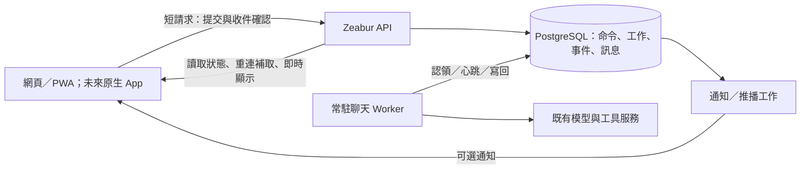

# 同場聊天可靠化與跨裝置恢復方案

- 建立日期：2026-09-19（Asia/Hong_Kong）。
- 狀態：P2-2 durable foreground execution、generated recovery、effect recovery、前端 outbox source slice、backup/restore proof、隔離 process-role rehearsal 與 committed-SHA release gate 完成。acceptance／worker flags 仍關閉，尚未執行正式 migration、role cutover 或 frontend rollout。
- 原始碼基準：`local/customizations` / `1b72362cfda36c5e9fcd44849bfe88d4050b3367`。
- 已完成 committed source image 的 P4 release evidence；未修改正式部署、未執行正式 migration。

### 0.1 已落地的 source slices

目前 source 已具備：

- `POST /api/v1/chat/turns` acceptance receipt 與 `GET /api/v1/chat/turns/{turn_id}` status lookup。
- SQL／in-memory command receipt、client idempotency、payload hash、conversation admission、lease generation fencing、heartbeat、bounded retry。
- `user_message_id`／position 與 `assistant_message_id`／position；user append 使用 `{turn_id}:user`，assistant append 使用 `{turn_id}:assistant`。
- ChatService `external_turn` durable seam：user row 先寫、模型完成後立即 checkpoint `generated`、assistant CAS append 後 `committed`；generated／committed recovery 不重新呼叫模型。
- durable foreground worker 的 `run_once`／poll loop，預設由 `YURALUME_DURABLE_CHAT_WORKER_ENABLED=false` 關閉。
- `chat_turn_effects` effect ledger，以 `(turn_id, effect_kind)` 與 stable idempotency key 追蹤 post-turn intent；post-turn worker 完成後標記 `completed`。
- post-turn effect 會先進入 `running` 再執行；中斷或未知結果轉為 `recovery_required`，不自動重播非逐項冪等的副作用。已提交回合的恢復只使用穩定 queue key 補排，不直接呼叫 post-turn body。
- status API 額外回傳 `post_turn_effect_state`（有 ledger row 時），可區分 canonical chat completion 與 post-turn intent 狀態。

這些是 source checkpoint，不代表 Zeabur 已套用 `t8d6f1a10058`／`u9e7b2a11059`，也不代表 production worker 已啟用。

前端目前也有 source-only client slice：`chatDurableOutbox.ts` 以 IndexedDB 保存待提交 payload，`durableChatClient.ts` 以原 `client_message_id` 重試／查詢；ACK 遺失與暫時 status 讀取失敗會保留未知狀態並退避重試，明確 4xx 進入 `needs_input`，terminal record 在 canonical history 成功補取後清理。`ChatPanel` 只有在 owner identity 已確定且 `VITE_DURABLE_CHAT_ENABLED=true` 時使用短請求 acceptance + polling，並在 reload、登入、換 conversation、online、visibility resume 時同步；`GET /conversations/{id}/active-turn` 讓重新進入或另一裝置取得 sending gate。預設仍使用既有 SSE，此 flag 不會因 source 部署自動開啟。

## 1. 決策與完成目標

先改造現有 Zeabur 後端及 Vue 網頁／PWA，讓伺服器在確認收件後，獨立負責完成回合或保存可查詢的失敗狀態。客戶端負責輸入、顯示與同步；切換分頁、關閉頁面或換裝置不應改變已收件任務的生命週期。

第一階段保留現有同場介面、串流效果與角色互動語意。Flutter／Tauri 原生客戶端及 Telegram 同場入口是後續選項，不是本次可靠性改造的前置條件。

本方案的完成判準：

1. 按送出後，畫面可明確區分「儲存在本機」「等待收件確認」「後端已接收」。
2. 後端回覆收件成功前，訊息與可供 worker 領取的工作必須已在 PostgreSQL 持久保存。
3. 同一訊息的傳輸重試使用同一識別碼，不產生另一筆邏輯回合。
4. API／客戶端斷線後，聊天工作仍可由常駐 worker 執行。
5. 任一已授權裝置可以找到該對話進行中的回合，並取得最終回覆或失敗狀態，不必持有另一裝置的記憶體變數。
6. 程序中斷後有明確恢復規則；不承諾能接續上游模型已中斷的 token stream，也不把結果不明的外部呼叫盲目重跑。
7. 原有同場敘事、訊息順序、租約、價格、undo、後處理及其他聊天渠道仍維持既有契約。

## 2. 授權範圍與資料邊界

### 2.1 本輪已授權

- 唯讀檢查原始碼、部署紀錄、正式站健康狀態與可取得的部署中繼資料。
- 寫入這份詳細方案，並更新必要的文件索引、歷史狀態註記與執行 checkpoint。
- 對方案進行可行性及一致性檢查。

### 2.2 本輪不執行

- 程式、schema、feature flag、runtime 或雲端設定變更。
- Git commit／push、建立服務、重啟、重新部署、正式 migration、備份／資料匯出。
- 改寫或重播既有聊天、角色、記憶、行程、約定、主動訊息或計費資料。
- 更換模型供應商、調整同場文風、修改其他渠道的角色語意。
- Redis／Celery／Temporal 等新依賴、完整原生 App、Telegram 同場模式。

未來實作以本文件為設計依據；取得實作授權後即可處理合理的局部實作細節。正式 migration、服務拓撲調整與可能新增費用的操作，依當時授權與 `AGENTS.md` 的部署規則辦理，不提前要求使用者建立服務或重做部署。

### 2.3 不可變資料規則

- 舊訊息內容、訊息 ID、順序、角色紀錄、歷史費用與既有 turn telemetry 保持不變。
- 新表與欄位採相容式新增；不把歷史 `processing` 紀錄自動轉成可執行新工作。
- 不把診斷、完整 prompt、聊天內容、API key 或設定密鑰寫進 log、通用 job payload、Git 文件或公開端點。
- 工作需要保存的使用者輸入屬於正式聊天資料，存入受相同授權／備份保護的專用命令資料表；附件保存既有受保護物件參照。
- PostgreSQL 與 storage 保持私有網路；沿用既有資料卷、加密設定與備份，不重新建立初始環境。

## 3. 已確認的基線與部署證據

### 3.1 原始碼現況

| 元件 | 已有功能 | 本方案需要補足 |
| --- | --- | --- |
| `api/routes/chat.py` | 既有 `POST /chat/messages/stream`、SSE heartbeat、`GET /chat/turns/{turn_id}`；source slice 另有 gated `POST /api/v1/chat/turns` 與 `GET /api/v1/conversations/{id}/active-turn` | 提交命令與生成回覆分離；先取得持久收件確認。新 route 仍由 `YURALUME_DURABLE_CHAT_ACCEPTANCE_ENABLED` 關閉 |
| `application/services/chat_service.py` | 儲存 user message、foreground turn lifecycle、租約與 finalizer；source slice 支援 `durable_turn_id`、generated／committed checkpoint 與 effect recovery | 將命令準備／執行／完成拆成 worker 可恢復契約；正式 worker／flag 尚未啟用 |
| `application/services/chat_stream_relay.py` | 客戶端斷線後，在同一程序的 asyncio task 繼續生成 | 執行權轉給持久工作與獨立 worker；瀏覽器消費速度不阻塞生成 |
| `frontend/src/components/ChatPanel.vue` | 部分 transport error 後輪詢 turn status／conversation | 持久 outbox、重新進頁找到 active turn、喚醒同步、跨裝置恢復 |
| `frontend/src/types/chat.ts` | message、attachments、presence、model 與價格相關輸入 | 穩定 `client_message_id`、版本化提交與確認契約 |
| `frontend/src/sw.ts` | 資產 precache、更新及 Web Push | 有界待送同步；不把 service worker 當長時間生成程序 |
| `bootstrap/process_roles.py` | `all`、`api`、`background`、`worker`、`coordinator`、`connector`；目前 Prod `all` 同時含 API、embedded scheduler、connector、coordinator、background worker | 新聊天 worker 接線與部署分工；目前只有在允許執行 background worker 的 role 且 opt-in flag 開啟時才建立 durable worker。Dedicated role 尚未與 Prod `all` 完成交接 |
| PostgreSQL background jobs／realtime outbox | durable claim、lease／fencing、通知 relay 基礎 | 借用設計與抽象，保留排程工作原有契約 |
| external chat receipts | request hash、lease、generated snapshot、條件寫入 | 現有實作限 LINE，不能直接當作 web／native 通用 queue |

重要區分：`turn_records` 的持久狀態讓「發生什麼事」可查詢，但單靠該記錄不能讓其他程序領取完整工作。前端的 `liveTurnId` 目前只在 Vue 記憶體中，元件卸載／角色切換會清除；缺少 turn ID 的恢復還會以訊息文字配對，並非可靠的訊息識別。

參考入口：

- [前端發送與恢復](frontend/src/components/ChatPanel.vue)
- [前端 API](frontend/src/utils/api/chat.ts)
- [API routes](src/kokoro_link/api/routes/chat.py)
- [Turn relay](src/kokoro_link/application/services/chat_stream_relay.py)
- [背景工作契約](src/kokoro_link/contracts/background_jobs.py)
- [External receipt 契約](src/kokoro_link/contracts/external_chat_turn.py)
- [程序分工](src/kokoro_link/bootstrap/process_roles.py)

### 3.2 部署狀態的證據層次

2026-09-19 的唯讀檢查：

| 檢查 | 結果 | 可證明的範圍 |
| --- | --- | --- |
| 使用者回報 | 使用者表示目前應已部署完成 | 應以現況重新核對，不能沿用舊 pending 文字作結論 |
| 本機與 GitHub 分支 | 都是 `8d4d827dd71367a8d40a901e6dbf81c151409261` | 原始碼已推到 GitHub；不等於 Zeabur 正在執行該版 |
| 正式站 `/health` | HTTP 200、`status=ok`、`site_settings_overlay=db` | 服務可回應，設定來源為 DB；不證明所有聊天功能、實際 commit 或 schema revision |
| Zeabur 官方 GraphQL 的 app deployment | `RUNNING`，commit 為 `8d4d827dd71367a8d40a901e6dbf81c151409261` | 正式部署已使用本機／GitHub 最新版本；不是等待部署的狀態 |
| Zeabur pod 狀態 | 觀測到一個 `READY` pod | 目前有一個就緒實例；`spec.replicas` 回傳 null，未另證實 desired replica 設定 |
| deployment 時間 | `finishedAt = 2026-09-16T15:00:15.014Z`，即香港時間 9/16 23:00:15 | 平台回報的部署完成時間 |
| 公開 `/api/v1/system/version` | HTTP 200，但 build SHA／tag／time 欄位為 null | 此端點不能獨立識別 commit；版本證據來自 Zeabur deployment metadata |
| Alembic／schema revision | 沒有取得現成的唯讀 revision metadata | 未核對 DB migration 狀態；不因此推定 migration 失敗或要求重跑 |

核對來源為官方 `https://api.zeabur.com/graphql` 的唯讀服務／deployment／pod metadata；既有認證可用，無須使用者重新登入、建立 token 或提供密鑰。未讀環境變數值、聊天、正式 DB 或執行日誌。

`UPDATE_PROGRESS_LOG.md` 的 2026-09-07 項目及舊暫存方案曾寫 lifecycle migration 待部署；本次已確認 app 最新版本部署完成，舊 pending 文字不再代表當前 app 狀態。`s7h3k9m10057_turn_lifecycle` 的實際套用情況，未來可透過已授權環境的 revision／schema metadata 核對；本輪不執行 Alembic 或資料庫操作。這不阻塞方案交付，也不構成現在重跑 migration 的理由。

### 3.3 與舊暫存方案的關係

[TEMP_SAME_SPACE_RELIABILITY_PLAN.md](TEMP_SAME_SPACE_RELIABILITY_PLAN.md) 保留 9 月上旬的問題、舊實作及驗證紀錄。本文件成為下一階段 durable chat 改造的正式設計入口；不把舊方案已完成的 lifecycle／前端修復列為待從頭實作。

後續若取得新版部署證據，補記核對時間、來源、SHA、revision、replica 與驗證範圍；保留歷史事實，不直接刪除過去的 pending 紀錄。

### 3.4 識別與版本詞彙

| 欄位／詞彙 | 唯一用途 |
| --- | --- |
| `source_commit_sha` | 原始碼 Git commit |
| `deployment_id`／`image_digest` | 平台部署身分／實際容器映像身分，與 source commit 分開記錄 |
| `schema_revision` | Alembic／資料庫 schema revision；不能由 commit 或 health 推定 |
| `conversation_revision` | 某一對話的內容版本，用於防止 lost update |
| `event_sequence` | 某一回合的事件游標，用於 replay／snapshot reset |
| `lease_generation` | worker ownership 的單調 fencing 版本 |
| `contract_version` | 命令／快照／API payload 的序列化契約版本 |

API 與紀錄避免只寫裸 `revision`。P0 與 worker 啟動相容性檢查分別確認所需 schema／contract 能力；source、schema、conversation、event 與 lease 的版本不能互換。

## 4. 目標架構



持久資料是判斷依據；SSE、LISTEN/NOTIFY、推播只加快顯示或提示。通知遺失時仍能查到結果。網頁讀取停止不應造成 worker 卡在有界 token buffer 等候該網頁消費。

優先沿用 PostgreSQL，避免為目前規模另增 queue broker。實作採獨立 foreground worklist／repository，與既有背景 queue 共用可抽出的 lease、metrics、DB 工具；不修改排程 queue 的 coordinator epoch、只保留 active key、7／30 天 pruning 等契約來遷就聊天。

## 5. 收件協定與客戶端 outbox

### 5.1 發送前

1. 為一次使用者送出意圖產生 UUID `client_message_id`；傳輸重試不更換 ID，修改內容後重新送出才使用新 ID。
2. 將文字、附件完成上傳後的受保護參照、角色／對話、presence、模型選擇與價格合約資訊寫入 IndexedDB。
3. IndexedDB 寫入成功才清空輸入框並顯示待送泡泡；儲存失敗時保留輸入並顯示可處理訊息。
4. outbox 以登入使用者分區，帳號切換不得送出上一位使用者的內容；登出後暫停該帳號的待送項目。
5. 首版每個對話最多一個未確認／進行中回合，維持既有互動節奏；不自動排入一串會使用過時上下文的訊息。

本機 outbox 只能保護同一裝置。尚未成功交給後端的訊息不能在另一裝置出現；介面須清楚標成「尚未送達」。無網路、系統停止 App 或本機儲存被清除時，不承諾訊息能自行送出。

### 5.2 後端接收

提交處理只做有界且必要的認證、擁有權、格式、附件參照、模式及價格／配額契約檢查，不等待 LLM、記憶擷取、圖片生成或其他長工作。

在同一個資料庫 transaction 中：

- 按 `(user_id, client_message_id)` 找到／建立命令，保存 canonical payload hash 與 contract version。
- 相同 ID、相同有效內容回傳原 `turn_id`；不同內容回傳 `409 idempotency_conflict`。
- 解析或建立唯一且受授權的 conversation identity，並檢查該 conversation 是否已有 active turn。
- 寫入 canonical 命令、對應的可執行 job 及初始事件；transaction 成功後才回覆已接收。
- 一個新 ID 若撞到既有 active turn，回傳 `409 conversation_busy` 與可授權查詢的 active turn 參照；不可顯示為已接收。

若 transaction 成功但 ACK 在網路遺失，客戶端沿用原 ID 查詢／重送，應取得同一回合；不得從「沒收到 ACK」推斷成「後端沒收到」。

### 5.3 客戶端狀態

| 本機狀態 | 顯示意義 | 動作 |
| --- | --- | --- |
| `saved_local` | 已保存，尚未送達 | 可嘗試提交；失敗不丟文字 |
| `submitting`／`acceptance_unknown` | 正在送出／尚未確認收件 | 以原 ID 查詢或退避重試 |
| `accepted` | 後端已保存 | 以 server turn 狀態為準，不再重新提交新回合 |
| `reconnecting` | 顯示連線中斷 | 不把 server processing 改成失敗 |
| `needs_input` | 登入、價格、內容或 busy 衝突需處理 | 保留文字，顯示具體原因 |

多分頁可用 BroadcastChannel 或同源鎖減少重複提交，但最後防重必須在後端。Service Worker 可處理短時間、平台支援範圍內的同步；不負責等待生成完成。

## 6. 資料模型與 API：現況與目標對照

以下把已在 source slice 出現的 contract／table／route 與後續可拆分的設計目標分開標示。實作前仍應用 ADR 記錄最終命名與契約；文件中的「目標」不能當成已部署證據。

### 6.1 資料模型

| 表／資料 | 主要欄位與責任 |
| --- | --- |
| `chat_turn_commands` | **目前實作／migration `t8d6f1a10058`**：`turn_id`、owner、character／conversation、`client_message_id`、canonical hash／version、不可變 payload、server state／phase、lease owner／generation／deadline、attempt、generated snapshot、message positions、result message ID、conversation revision 與 failure 欄位。這一列同時承擔目前的 worklist 與 acceptance receipt |
| `chat_turn_jobs` | **後續目標，現在沒有此表**：若未來需要把 queue metadata 從 command 拆出，只存 `turn_id` 等參照、run phase、lease、next run、attempt、heartbeat；不放聊天文字與完整 prompt。隔離 rehearsal 不得假設此表存在 |
| `chat_turn_events` | **後續目標，現在沒有此表**：若未來需要 replay cursor，再新增 `turn_id`、單調 sequence、事件型別與受保護 snapshot 參照；目前 status／phase／snapshot 由 `chat_turn_commands` 查詢，沒有獨立 event log |
| `chat_turn_effects` | **目前實作／migration `u9e7b2a11059`**：以 `(turn_id, effect_kind)`、stable idempotency key、state／attempt／error 及 timestamp 追蹤 post-turn intent；不保存供應商密鑰 |
| 既有 conversation／turn records | 維持權威聊天歷史與 observability；以穩定 turn ID 關聯新命令 |

約束：

- `(user_id, client_message_id)` 在回合完成後仍防重，不能沿用「只有 active row 唯一」的排程 job 規則。
- 一個 active foreground command 對應一個邏輯回合；job 多次認領不建立新的 user message 或新的 logical charge。
- 防重保證限於本系統的 canonical command、message append 與應用帳本識別；不宣稱外部 provider invocation／實際供應商費用 exactly-once。上游結果不明時，charge 可維持 `reconciliation_required`，待對帳後才能 settle／release，不能用自動退款或立即扣定來掩蓋未知結果。
- 對同一 conversation 的 active admission、user message append 與結果 commit 使用資料庫條件寫入；原有跨渠道租約仍需保留，兩者不可互相取代。
- 首版不新增自動刪除命令／receipt 的 retention 任務；日後清理仍保留防重所需的最小 tombstone，並另行制定規則。
- token chunk 可合併為有界進度快照，不要求每個 token 一筆 DB row；最終文字和狀態必須可持久查回。
- 既有 `turn_records.status` 與新命令狀態需有單向、可測試的對應；不可形成兩個互相覆蓋的權威狀態來源。
- 目前 API 啟動時會把安靜超過五分鐘的舊 processing record 標成 `aborted_by_restart`。新 durable 回合由 command／job ownership 判斷，必須排除在舊 reconciliation 範圍之外，避免 API 重啟誤判仍存活的 worker。

### 6.2 API

目前 source slice 已存在但仍由 flag 關閉的 endpoint 是 `POST /api/v1/chat/turns`、`GET /api/v1/chat/turns/{turn_id}` 的 durable status 分支，以及 `GET /api/v1/conversations/{id}/active-turn`。其餘下表標為「目標」的 path 尚未實作；不能在 Zeabur rehearsal 中以 route 存在推定功能已可用。

所有玩家 API 沿用登入與擁有權驗證；原生客戶端未來使用同等 owner scope，不把 external LINE caller 身分當玩家登入使用。

| API 草案 | 契約 |
| --- | --- |
| `POST /api/v1/chat/turns` | **目前 source slice，flag 關閉**。傳入 client ID 與版本化 payload；新接收回 `202`，duplicate 回原 `turn_id` 與目前狀態；不等待模型 |
| `GET /api/v1/chat/turns/{turn_id}` | **目前 source slice，flag 開啟時查 durable row**。回傳 state、phase、failure code、result message／message positions、`conversation_revision`、lease 與 snapshot hash；目前沒有 `event_sequence` |
| `GET /api/v1/chat/turn-requests/{client_message_id}` | **目標**。僅在目前登入 owner 範圍內解析未知 ACK；查不到不能導致換 ID 自動重送 |
| `GET /api/v1/conversations/{id}/active-turn` | **目前 source slice，flag 關閉**。新裝置／重新進頁找進行中或需要處理的回合；無 active turn 回傳明確結果 |
| `GET /api/v1/chat/turns/{turn_id}/events?after_sequence=N` | **目標**。可重連的 SSE 顯示通道；cursor 過期時回 snapshot/reset 指示，再接續新事件 |
| `POST /api/v1/chat/turns/{turn_id}/cancel` | **目標**。首版只支援 worker 尚未領取的 queued turn；與 claim 競爭由 DB 原子判斷，不能把 active turn 假裝取消成功 |

傳輸層正常斷線不是 server failed。狀態查詢暫時失敗也不能改寫任務狀態。`429`／`503` 應有可採用的退避資訊；`401` 暫停 outbox 待重新登入；未知 turn 對非 owner 不透露是否存在。

價格、附件、nudge、進入場景等 payload 需版本化；不能只支援純文字後，把 UI 其他既有按鈕悄悄接回舊長請求。

## 7. Worker、恢復與副作用

### 7.1 伺服器生命週期

```text
queued -> processing -> generated -> committed -> completed
   |           |             |             |
cancelled   retry_wait / recovery_required   post-turn intent 已持久保存
               |
             failed
```

- `queued`：輸入已保存，尚未執行模型或工具。
- `processing`：worker 有效持有租約，正在準備上下文或生成。
- `generated`：完整結果／必要 effect checkpoint 已保存，可從該結果完成 commit。
- `committed`：聊天結果已寫入既有歷史；剩餘工作只處理已保存的後處理／通知意圖。
- `completed`：玩家可取得完整回覆，必要後處理意圖已可靠登記；不代表記憶／行程等所有非同步後處理都已完成。
- `retry_wait`：僅限已證明安全的步驟重試，保留同一 `turn_id`。
- `recovery_required`：外部 effect／模型呼叫結果不明或相容性衝突，停止自動重播並顯示原因。
- `failed`／`cancelled`：明確終止狀態，保留可查資訊；不得無紀錄回到 queued。

對話收到可用答案後，不應因推播失敗而一直顯示「角色正在回覆」。處理、歷史 commit、推播與裝置已讀分別追蹤。

### 7.2 認領與租約

- worker 透過 PostgreSQL 原子 claim（例如 row lock／`SKIP LOCKED`）領取有資格的工作。
- lease 使用 DB clock，所有續租、phase transition、完成寫入與 ownership-sensitive effect 都攜帶單調 fencing generation。
- 舊 worker 在租約接管後不得繼續發布 canonical 結果；僅靠 heartbeat 或本機取消旗標不足以防止 split execution。
- job lease 與既有 chat／character lease 的取得順序、renew、release 設計成明確單一責任，避免雙重釋放與互相等待。
- 首版每個 canonical conversation 僅有一個 active foreground turn；跨渠道採用既有租約／排序政策，不另放寬並發。
- 命令已收件後，worker 若遇到既有聊天租約忙碌，保持工作可查並有界退避，等待釋放；不能把 worker 的 `ConversationBusyError` 當成工作完成。若等待過久，進入明確 timeout／需處理狀態，而不是永遠隱藏在 queue。
- 長 worker 工作不在 DB transaction 內等待 LLM；準備、認領、checkpoint、commit 使用短 transaction。

### 7.3 重啟恢復矩陣

| 中斷位置 | 恢復策略 |
| --- | --- |
| 後端尚未接收 | 留在本機 outbox，原 ID 重試 |
| 已接收，worker 未開始 | 新 worker 領取原 job |
| 準備階段，確定尚未外呼 | 依同一 turn 的 checkpoint 安全重試 |
| 模型／工具已發出，但未取得可持久結果 | 預設進 `recovery_required`；只有供應商的受支援查詢／冪等契約能證明安全時才自動恢復 |
| 完整 generated snapshot 已保存 | 從 snapshot finalize，不再呼叫模型 |
| assistant 已寫入，狀態／事件尚待補齊 | 依 turn ID 與 message ID 對帳，補齊狀態，不重複 append |
| 後處理意圖已保存但通知遺失 | outbox dispatcher／reconciler 補送意圖，不重做已 commit 的回合 |
| SSE／Push 遺失 | 客戶端查 status／history／cursor，worker 不受影響 |

重試上限與 backoff 按工作 phase 區分；不得直接採用現有 background queue 的預設五次重跑。租約過期只代表 ownership 需處理，不證明上游呼叫未產生費用或副作用。

`recovery_required` 必須有可操作的結束流程，不能成為永久的 sending lock：先依既有 snapshot／provider request ID 對帳；無法查證時，使用者或管理者可以明確選擇保留待查，或結束這次等待。結束等待須先 fence 舊 worker 並終止 canonical 命令，才釋放本系統的對話 gate；不聲稱已取消外部工作或完成費用對帳。帳務仍可維持 `reconciliation_required`。之後若使用者主動發起新回合，使用新 ID 並保留與原回合的關聯，不能在背景自動重播舊命令。舊 client ID 的重試始終回原回合結果／狀態。這類 resolve 動作需有 owner／admin 授權與 audit，具體 endpoint 在 P0 定案。

### 7.4 ChatService 相容性

- API 收件不直接執行目前完整 `send_message_stream` prelude；抽出可由 worker 執行的版本化命令處理入口。
- 使用者輸入、presence、model 選擇、quote 與附件參照在收件後不可被客戶端重試改寫。
- 動態上下文（角色狀態、行程、記憶、對話）在 worker 取得既有 chat lease 後準備；保存本輪使用的時間基準與版本／revision，generated 之後的恢復不重新取得另一份上下文來重生答案。
- 接收時建立的 conversation identity 必須與後續執行一致，不能讓每次重試各自 resolve 出新對話。
- client quoted price 僅為使用者同意的合約輸入，必須由伺服器驗證；reservation／settlement／release 以 stable turn ID 防重並可對帳。
- 現有 quoted prices、interaction 等有 ContextVar scope；worker 跨程序後必須從受驗證命令重建 scope。另保存 action charge／image quota reservation 的識別與狀態，不能因舊程序的 in-memory handle 消失而判定未扣費或未開始。
- 若 queued 期間價格或可用模型改變，沿用已驗證合約或回覆明確需重新確認的結果；不能在 worker 執行時默默換模型、提高價格或重建第二筆 reservation。
- 使用者訊息只 append 一次；尚未 append 到歷史的 accepted command 可作為 pending 投影顯示，與稍後 canonical user message 依 ID 合併。
- 將最終 assistant append、狀態變更及可重送後處理意圖放入可驗證的 commit 邊界。跨 repository 目前若不能共用 transaction，必須先補 Unit of Work／CAS 與崩潰對帳，不假設跨多次 `save()` 自然原子化。
- 原有 post-turn memory／promise／schedule／story arc、媒體產生、工具副作用及通知各自保留穩定 effect key 和 checkpoint；不能僅以整個 turn 的防重取代各 effect 的去重。
- 現有 post-turn 明確記載部分 emotion／promise／schedule additive writes 尚未逐項冪等；P0 必須盤點各 effect 的實際保證。對未證明可重試的 effect 不自動重播，也不在 enqueue 結果不明時啟動第二套 in-process fallback。完整 durable post-turn 宣稱只能在這些缺口驗證後成立。
- 原有 prompt telemetry 仍在既有受控位置記錄實際送出的 prompt／pack hash、model 與 usage；不把整份 prompt 複製到通用 job payload、此文件或普通 log。
- undo／open scene／刪除／匯入與進行中命令互相檢查；首版不允許透過重新進頁繞過既有 busy／undo gate。
- legacy web、Telegram、LINE、主動訊息不自動遷入新 worker；交接期間仍需共用正確的 conversation／character lease。

## 8. 同步、即時顯示與 PWA

進入聊天頁、登入完成、從 background 回到 visible、`online`、頁面恢復及串流中斷後，都觸發同一套可去重的同步程序：

1. 解析此登入 owner 的本機 outbox，查明未知 ACK。
2. 讀取該 conversation 的 active turn 與最新 revision。
3. 取得 canonical history／result message，按 message ID／turn ID 合併 optimistic bubble。
4. 若仍有 active turn，從最後 sequence 接續事件；無法串流時用有 jitter、退避及上限頻率的 status polling。
5. cursor 過期、裝置第一次進入或資料有缺口時，以 server snapshot 重建，再繼續接事件。

不得以使用者訊息「文字相同」識別同一回合；相同文字可能是不同合法訊息。不得把每個裝置的顯示／已讀 ACK 當成生成工作完成條件。

PWA 更新時保留 outbox 與必要的版本升級處理；新 service worker 啟用不應讓未確認訊息消失。舊 bundle、舊 service worker、新 API 同時存在是必測情況。

推播是選配提示：保存通知意圖、使用 turn-based dedupe key、打開後重新取權威狀態。沒有通知權限也必須能可靠聊天；通知 preview 維持既有隱私設定。

## 9. Zeabur 部署設計

### 9.1 目前環境

按既有 runbook，正式環境為同一 project 的 `app`、`postgresql`、`storage`，app 採一個 `all` replica。此處記錄基線，不授權現在改變拓撲。

### 9.2 建議的第一個部署形態

| 服務 | 目標責任 | 對外暴露 |
| --- | --- | --- |
| `app` | `api`：登入、前端、收件、查詢、SSE；不擁有 Telegram polling／scheduler | 保留既有 HTTPS domain |
| `coordinator`（新） | 承接既有 due discovery、leader lease 與 site-global scheduler；不執行 job body | 僅私有 health／metrics |
| `chat-worker`（新 Zeabur service，role=`worker`） | 承接既有 background job claim／execute，並在 cutover 後以 opt-in flag 執行 foreground chat claim／恢復；不啟動 API、scheduler 或 connector | 僅私有 health／metrics |
| `connector`（新） | 承接 Telegram／Discord／WhatsApp connector lease 與 retry | 僅私有 health／metrics |
| `postgresql`／`storage`（既有） | 保留正式資料與物件 | 私有網路 |

`chat-worker` 是新的 Zeabur service name，不是新的 process role；它使用已存在的 `worker` role，並由 `YURALUME_DURABLE_CHAT_WORKER_ENABLED` 控制 foreground loop。source wiring 已存在，但 service 尚未在 Prod 建立／rehearse；既有 `worker` role 同時承擔 background queue，因此不能只改 service 名稱就視為 ownership 已隔離。

如果同一主機資源測量不適合新增 dedicated services，可評估在未來完成隔離接線的 host 上執行獨立 chat queue，保留分開的 concurrency quota；這是尚未驗證的降本替代方案，需記錄隔離程度與測量結果，不能直接啟動另一個 `all` replica。

### 9.3 必要接線與資源驗收

- 同一套相容 image，不同 role；configuration／provider hot reload、realtime PostgreSQL outbox 與 private health 路由需完成跨程序驗證。
- API、聊天 worker、background 的 CPU／memory、DB pool 及 concurrency 分別測量；同主機分程序可降低互相阻塞，但不能消除整台主機故障。
- 初期 API 與 chat worker 都採單 replica；可靠性先靠持久工作、ownership 與恢復取得，不以直接增加 all replicas 代替修正。
- shutdown 先停止新 claim／admission，再保存 phase、釋放或移交租約；部署 drain 有上限，超時工作依恢復矩陣處理。
- chat-worker readiness 應確認可使用正確 schema、執行 loop 存活；API readiness 與輕量 liveness 分開量測。
- 服務 health／memory 壓力需與 LLM 延遲分開記錄，不能以延長 proxy timeout 當作唯一改善。
- 正式角色交接確保舊 `all` polling／scheduler 已停止或完成 ownership 交接，才讓新 background 成為 owner。切換前更新並遵守 `AGENTS.md` 的現行拓撲規則。
- 新服務及其資源費用、正式變數與切換順序在部署階段提出具體清單；此時無須使用者預先購買或設定。

### 9.4 從現有 `all` 交接到 dedicated roles

這是必要的 ownership runbook。現有 Prod 的 `all` role 會同時啟動 public API、embedded scheduler、connector、background coordinator 與 background worker；因此不能在同一個 Prod PostgreSQL 上先啟動另一個 `worker`／`coordinator`／`connector` 就宣稱完成隔離。兩個 owner 同時 polling 會造成重複排程、connector lease 競爭與不可解釋的 recovery。

目標拓撲與責任如下，既有 `app` service 保留名稱但改成 `api` role：

| 服務 | `YURALUME_PROCESS_ROLE` | 啟用責任 | 交接後不得再執行 |
| --- | --- | --- | --- |
| `app` | `api` | public API、frontend、durable acceptance／status、SSE | scheduler、connector、background coordinator／worker、durable foreground worker |
| `coordinator` | `coordinator` | due discovery、leader lease、site-global scheduler | public API、connector、job execution |
| `worker` | `worker` | 既有 background job claim／execute；cutover 後才開 durable foreground worker | public API、scheduler、connector |
| `connector` | `connector` | Telegram／Discord／WhatsApp connector lease | public API、scheduler、queue worker |

`background` 是 transitional／隔離 rehearsal role，不與 Prod `all` 同時承擔同一批 owner；不得把它和 `all` 一起當成正式雙 owner。若現有 Zeabur image 尚未能以這四個 role 啟動，先停在隔離環境補 wiring，不能用再開一個 `all` replica 代替。

正式切換順序固定如下：

1. 先完成 fresh backup、restore proof、Prod 唯讀 revision／table／index 核對，以及相容 image 的 build SHA 記錄；兩個 durable flags 保持關閉。
2. 以同一 image 在隔離 project／還原 DB 完成 role startup、shutdown、restart、lease takeover 與 worker health rehearsal。此階段不得連到 Prod DB。
3. 進入維護窗口，暫停 durable acceptance 與前端 flag，並停止會產生新背景工作的外部入口；等待 `all` 的 in-flight loop 進入 drain 或按既有 lease 規則落入可恢復狀態。
4. 先把既有 `app` service 的 process role 切為 `api` 並重啟。確認 `/health` 正常，且 DB 中不再看到該 `all` instance 的 scheduler／worker／connector heartbeat 或 active lease；沒有 ownership 證據就停止，不啟動 dedicated roles。
5. 啟動 `coordinator`，確認只有它取得 coordinator／leader lease，且 `/health` 與 internal metrics ready。
6. 啟動 `worker`，先保持 `YURALUME_DURABLE_CHAT_WORKER_ENABLED=false`，確認既有 background job 能由單一 worker claim／complete，沒有舊 `all` owner 回來搶 lease。
7. 啟動 `connector`，逐一確認 connector lease、inbound receipt 與 outbound retry；不要在 connector 未 ready 前恢復外部入口。
8. 由 operator 執行 owner／lease、DB pool、memory／CPU、health 的 cutover checklist；任何 duplicate claim、old owner heartbeat、schema mismatch 或 readiness failure 都是 no-go，回到 flags 關閉狀態。
9. 只在前八步穩定後，將 `YURALUME_DURABLE_CHAT_WORKER_ENABLED=true` 設在 dedicated `worker`，確認它是唯一 foreground worker owner；再按第 10.1 節先開 backend acceptance、後開 frontend build flag。

若不能在不重疊 ownership 的情況下完成第 3–7 步，保留現有 `all` 不變並停止 Prod cutover；隔離 rehearsal 可以繼續，但不得以「多開一個 worker」繞過交接。

## 10. Migration、相容性與回退

採 expand → 相容上線 → 驗證 → 切換入口的方式：

1. 確認正式 commit、Alembic revision、schema 差異及現有 restore／backup 能力；先處理證據，不先跑 `upgrade`。
   具體順序是：先建立 Zeabur native backup 並實際還原 `data/data.sql` 到 disposable PostgreSQL，再從還原副本產生 derived custom-format dump 並以 `pg_restore --list`／第二次 restore 驗證；對還原副本與 Prod 唯讀查詢 `alembic_version`、兩個 durable tables 與 indexes，再將結果與 source head `u9e7b2a11059` 比對。revision 多頭、ahead、分支不一致或 schema definition 不相容時停止，不用 downgrade 強行對齊。
2. 只新增表／相容欄位／索引，不移除舊 `turn_records` 欄位或既有聊天 route。
3. feature gate 預設關閉；舊客戶端繼續使用舊 route，新客戶端先查 server capability。
4. 未提交前可按 capability 選擇舊路徑；一旦提交新 command 或 ACK 不明，不能因 timeout 自動 fallback 到舊 POST，否則可能生成第二輪。
5. 新舊 route 共存期間共用正確的 admission／lease／undo gate；舊 route 不被當作繞過新 active turn 的後門。
6. 先在隔離環境驗證 migration、舊版程式讀取、雙版本客戶端與 worker 恢復，再產出具體 release 計畫。
7. 正式 migration 前按 `AGENTS.md` 取得該操作授權，製作並驗證 Zeabur native backup、disposable restore 與 derived custom-format dump；一次受控 migration，不在本機和雲端同時執行。
8. 先部署支援新 schema／相容 API 的版本與 worker，再啟用少量同場流量；驗證後擴大。

回退規則：

- 停止接受新 durable command，不丟棄已接受的 command 或已存在的 outbox ID。
- 保留具處理能力的 API／worker 直到已接受工作完成或獲得可追蹤的中斷結果；舊 binary 無法接手 durable jobs 時，不能直接全面回退。
- 優先關閉新入口並退回上一個具相容能力的版本；additive schema 保留，正式環境不以破壞性 downgrade 清除新資料。
- DB 還原僅適用已確認的 schema／資料損壞事件，需另有操作方案；不是一般 app rollback 的預設步驟。
- 舊 pending 部署紀錄不作為再次建立資料庫、匯入舊 dump 或重跑 migration 的依據。

### 10.1 隔離 rehearsal 通過後合併到 Prod 的 runbook

這裡的「合併到 Prod」是把已驗證的 source image、additive schema、service role 與 flags 依序帶入正式環境；不是把隔離 PostgreSQL 直接覆蓋 Prod，也不是把隔離資料匯入正式聊天資料。

#### A. 形成可審查的 evidence pack

在離開隔離環境前，必須保存同一份 release SHA／image digest 的下列證據：

1. Zeabur native backup archive 的檔名、時間、大小／checksum、manifest、實際 SQL restore、derived custom-format dump 的 `pg_restore --list` 輸出，以及第二次 restore；storage 的 `objects/` 與 `metadata/` 也要有 archive manifest／checksum。
2. 還原 DB 與 source 的 Alembic chain：單一 head，`s7h3k9m10057 -> t8d6f1a10058 -> u9e7b2a11059` 順序正確；`chat_turn_commands`／`chat_turn_effects` 的 table、constraint、partial／普通 indexes 與 source definition 一致。
3. A01–A25 中已執行案例的結果，至少包含 ACK 遺失、API／worker restart、phase recovery、兩裝置 lookup、effect recovery、舊 SSE regression 與 legacy client compatibility；未執行案例要明確列為阻塞，不可用 unit test 代替。
4. `api`、`coordinator`、`worker`、`connector` 的 startup／shutdown／health、唯一 owner／lease、DB pool、CPU／memory 與 logs；證明沒有 `all` 與 dedicated role 同時 claim 同一責任。

#### B. Prod preflight 與 schema gate

1. 選定維護窗口並記錄預定 rollback owner；先確認目前 source SHA、Zeabur deployment ID／image digest、`/health`、legacy SSE regression，以及兩個 durable flags 都是關閉。
2. 在同一窗口建立 fresh Prod backup，完成 native archive manifest、disposable SQL restore、derived custom dump 的 `pg_restore --list` 與第二次 restore proof；backup 尚未可還原時不得進入 migration。
3. 以與 app 相同的私有 `DATABASE_URL` 做唯讀查詢：`SELECT version_num FROM alembic_version`、兩張 durable table 的存在性、`pg_indexes` 定義；再與 disposable restore 及 source head 比較。Prod revision ahead、multiple unexpected heads、missing／divergent chain、table/index definition 不一致，或 backup restore failure 都是 no-go。
4. 通過 gate 後才可用一次受控 migration 將 `t8d6f1a10058`、`u9e7b2a11059` 依序套用；migration 執行期間不能再由本機或另一個 Zeabur service 同時跑 `alembic upgrade`。完成後重做同一組唯讀查詢並保存結果。

#### C. 相容 image、role cutover 與 canary

1. 先部署包含新 code 的相容 image，但保持 `YURALUME_DURABLE_CHAT_ACCEPTANCE_ENABLED=false`、`YURALUME_DURABLE_CHAT_WORKER_ENABLED=false`、`VITE_DURABLE_CHAT_ENABLED=false`；確認 legacy route 可用。
2. 按 §9.4 的順序把 `all` 交接成 `app=api`、`coordinator`、`worker`、`connector`。在 worker role 穩定且唯一 owner 證據成立前，不可開 foreground worker。
3. 只在 dedicated `worker` 開 `YURALUME_DURABLE_CHAT_WORKER_ENABLED=true`，先觀察 liveness、claim loop、lease 與既有 background job；若 worker 不能 ready，關閉 flag 並停止 cutover。
4. 後端 acceptance flag 先開。現在的 backend flag 是全域環境 flag，source slice 沒有內建 cohort allowlist；因此「小量 cohort」只能用受控測試帳號／維護窗口的 direct API canary，不能把全域 flag 描述成真正的百分比 rollout。若需要正常流量中的百分比 cohort，必須先另做 allowlist／routing slice。
5. Canary 使用專用測試角色與全新 `client_message_id`，逐一驗證：`202` receipt、相同 ID duplicate submit、status／active-turn lookup、API restart、一次 graceful worker restart、第二裝置補取、單一 user／assistant append 與 post-turn effect。不要在 Prod 重播未知 provider／billing effect；故意 kill 每個 phase 只在隔離環境做。
6. Canary 通過後才發布 `VITE_DURABLE_CHAT_ENABLED=true` 的 frontend build；前端開啟後仍保留 legacy route 作 rollback 入口，但 durable submit ACK unknown 時不得 fallback 到 legacy POST。若 frontend flag 是全域 build，需把這次視為全域 cutover 並取得對應操作確認。

#### D. Go／no-go 與觀察窗口

| 判定 | 必須證據 |
| --- | --- |
| Go | backup 可還原；單一正確 Alembic head；兩張實際 table／indexes 符合 source；`all` 無 owner；四個 dedicated role healthy；canary 無 duplicate append／charge／effect；ACK／status／跨裝置 recovery 通過；legacy regression 無新增錯誤 |
| No-go | revision 或 schema 不一致、backup 無法還原、舊 `all` heartbeat／lease 仍存在、任何 duplicate history／billing／effect、worker liveness 不穩、canary status 無法查回、需要把 unknown ACK fallback 到舊 POST，或 flags／cohort scope 無法明確控制 |

預設觀察窗口是至少三個完整 canary turns 且連續 30 分鐘無 blocker，再進入一般流量；一般流量至少觀察一個完整日週期。窗口內持續保存 accepted／processing／recovery_required oldest age、lease takeover、ACK lookup、duplicate、API／worker restart、DB pool、CPU／memory 與 legacy error rate。任何 no-go 條件先按 rollback 規則關閉 frontend，再關閉 backend acceptance；worker 留下來把已接受工作完成或明確 fencing，不能直接刪表或 downgrade。

#### E. Release merge 與結果保存

所有隔離測試通過後，才把 reviewed source commit 合併／推到 Zeabur 使用的 deployment branch，並以該 SHA 建立 app／dedicated role 的同版 image。部署完成後保存 Zeabur deployment ID、image digest、每個 service role／replica、實際 schema revision、flags、canary turn IDs 與監測窗口；不可用「部署成功」取代資料庫與 worker ownership 證據。若 merge 後 build SHA 與 rehearsal SHA 不同，整個 evidence pack 失效，必須重新跑相容性與 canary gate。

## 11. 可觀測性與錯誤呈現

每個操作以 `client_message_id`、`turn_id`、conversation、job、attempt／lease generation、event sequence 關聯。玩家回覆只給可理解的錯誤代碼與處理動作，完整 provider exception 仍留在受保護且去敏的診斷。

主要量測：

- 從送出到 ACK、ACK 到 claim、claim 到 first token／generated、generated 到 committed、完成到裝置補取的延遲。
- accepted／processing／recovery_required 數量與 oldest age；worker heartbeat、claim loop、lease takeover 次數。
- ACK 遺失後成功找回、冪等重送、hash conflict、conversation busy、SSE reconnect／snapshot reset。
- API health latency、event-loop lag、memory／CPU、DB pool 等待、部署 drain 與程序 restart。
- duplicate message／settlement／post-turn effect 防重結果；通知延遲不混入生成時間。

初始可驗收的性能目標（測試目標，非目前已達成的承諾）：在健康 DB、有效登入、無附件上傳、無冷啟動的受控負載中，API 提交至 ACK 的伺服器端 p95 ≤ 1 秒；恢復到前景且網路可用後，已完成結果在 5 秒內補取。上游模型生成時間另行量測，不包含在 ACK SLO。

## 12. 驗收與測試矩陣

先完成有意義的契約、PostgreSQL integration 及故障注入，再做瀏覽器／裝置實測。不用只檢查 mock call 次數的測試代替交易與重啟驗證。

| 編號 | 情境 | 必須通過的結果 |
| --- | --- | --- |
| A01 | 點送出但網路未送到 API | 保留本機文字，顯示未送達，不聲稱後端處理中 |
| A02 | DB commit 後故意丟 ACK | 原 ID 重試找到同一 turn；只有一筆 logical command／user append |
| A03 | 同 ID 不同內容 | 409 conflict，不能覆寫原輸入 |
| A04 | 快速連按、兩分頁同時發送 | 相同 ID 防重；不同 ID 受 active admission 控制 |
| A05 | 兩裝置同時對同一 conversation 發送 | 執行順序符合既有 lease／busy 契約，無重複 assistant 或 lost update |
| A06 | 使用者重複發送相同文字 | 依 ID 正確區分，無以文字錯配回覆 |
| A07 | ACK 前／後關頁、換角色、reload | 未 ACK 可重新解析；已 ACK 的 server 工作不隨頁面取消 |
| A08 | 手機鎖屏、切 App、分頁凍結後返回 | 恢復 snapshot／cursor；不需手動重新送出 |
| A09 | 換裝置登入 | 取得 canonical history 及 active turn；不依賴原裝置 outbox |
| A10 | SSE 中途斷線、丟 terminal frame | 最終結果可查回；無永久 sending lock |
| A11 | 客戶端長時間不讀 token | worker 不因前端背壓停滯；buffer／DB event 增長有界 |
| A12 | API 重啟但 worker 存活 | 已 ACK 任務繼續；客戶端重新連線補取 |
| A13 | worker 在每個 phase 被終止 | 各自按 §7.3 恢復；generated 後不重跑 LLM |
| A14 | 舊 worker 租約過期後恢復 | fencing 阻止舊 owner commit 或重複發布 |
| A15 | 工具成功但 reply／checkpoint 回報遺失 | 可查證則對帳，否則 recovery_required；不盲目重做工具 |
| A16 | finalizer 中斷、計費結算重試 | 同一應用帳本 charge／append 不重複；可查證的 reservation 正確釋放／結算，未知上游結果明確保留待對帳，不自動加收或退款 |
| A17 | queued 期間模型／價格／登入權限改變 | 遵守已驗證合約與當下授權，不擅自加價／換模型 |
| A18 | queued cancel 與 worker claim 同時發生 | 只有一個有效結果，不能取消成功後仍開始新 effect |
| A19 | undo／open scene／還原與 active turn 競爭 | busy／revision／tombstone 規則一致，不復活已 undo 內容 |
| A20 | 重啟後 post-turn／push 補送 | 意圖不遺失、已完成 effect 不重複；通知失敗不改成聊天失敗 |
| A21 | IndexedDB 配額不足、登入帳號切換、PWA 更新 | 保留輸入／隔離 owner，無跨帳號送出或遺失未確認訊息 |
| A22 | 舊前端＋新後端、新前端＋舊後端 | capability／相容欄位正常；提交不明時無雙路徑 fallback |
| A23 | 非 owner 猜 ID／附件參照／cursor | 無越權訊息、進度或錯誤資訊洩漏 |
| A24 | migration rehearsal、feature rollback | 舊歷史不變；已接受新工作有可用的讀取與恢復路徑 |
| A25 | 同場文字／附件／示意／工具／defer | 均保留原有語意與計費，不只有純文字走可靠路徑 |

正式環境驗收以已授權的測試角色／測試回合及唯讀監測進行；破壞性斷電、故意 kill worker、重播工具等先在隔離環境驗證，不拿既有真實對話作故障注入。

## 13. 實作分期與依賴

| 階段 | 工作 | 出口條件 |
| --- | --- | --- |
| P0 基線與契約 | 核對正式 revision、既有 source、API／狀態機、pricing／lease／effect、schema ADR | 差異與風險有可查紀錄；不重做舊功能 |
| P1 持久收件 | 專用 command／job schema、原子 admission、冪等 API、owner-scoped lookup | A01–A06、A23 及 transaction crash 測試通過 |
| P2 執行恢復 | command executor、generated checkpoint、lease／fencing、finalizer／effect outbox、專用 worker | A11–A20、A25 及 PostgreSQL parity 通過 |
| P3 前端同步 | IndexedDB outbox、ID 合併、active lookup、SSE cursor、wake-up sync、PWA 相容 | A07–A10、A21–A22 跨頁面／裝置通過 |
| P4 隔離部署驗證 | migration rehearsal、role wiring、資源量測、恢復／回退演練 | A12–A16、A24；單一 polling／scheduler owner |
| P5 正式分批上線 | 備份與受控 migration、相容部署、role 交接、小量啟用、監測 | ACK／恢復目標通過；無重複歷史或費用，運作證據已保存 |
| P6 可選客戶端 | 按實際裝置需求評估 Flutter／Tauri／Telegram 同場 | 獨立 scope／設計決策，不阻塞 P1–P5 |

P1 與 P2 可先在隔離環境整合；未有可運作 worker 與狀態查詢前，不對正式 UI 開啟「可靠收件」。P3 可先依已定契約開發，但正式 cutover 依 P4／P5。

### 13.2 P1-1 本輪實作切片

- 新增 `ChatTurnCommand` contract／state enum，固定 canonical payload hash、owner scope、client ID 防重與 active conversation admission 的語意。
- 新增 in-memory adapter，先以 parity tests 鎖住 duplicate、hash conflict、busy、owner isolation 與 canonical JSON 穩定性。
- 新增 SQLAlchemy model／adapter 與 additive Alembic migration；migration 只建立新表與索引，這一輪不執行。
- 將 repository 接入 `ServiceContainer`，但不把尚未有 foreground worker 的新提交 endpoint 接到 production UI。
- 下一個切片才加入短提交 API／active lookup；再下一個切片接 worker claim／lease，避免先回覆一個實際無法執行的「已接收」。

P1-1 source checkpoint（2026-09-19）已完成：contract、in-memory／SQLAlchemy adapter、ORM model、`t8d6f1a10058` migration、container wiring 及 migration／adapter tests 均已加入。Focused suite 為 11 passed；SQLite smoke 確認 rollback 後回傳 immutable snapshot，避免 ACK 路徑的 SQLAlchemy expiry bug。Alembic heads/history 由 `.venv` 驗證為 `t8d6f1a10058` 接在 `s7h3k9m10057` 後。尚未執行 migration、啟用 endpoint 或部署。

P1-2 source checkpoint（2026-09-19）已完成：新增 `POST /api/v1/chat/turns` 與 durable turn status lookup，要求 `client_message_id`、固定 conversation target、回傳 duplicate／busy／hash-conflict 語意；開關 `YURALUME_DURABLE_CHAT_ACCEPTANCE_ENABLED` 預設關閉，未有 worker／migration 時不會接收正式流量。focused acceptance route tests、P1-1 tests 與既有 stage/stream tests 通過；新 endpoint 尚未接前端。

P2 preparatory compatibility（2026-09-19）已完成：`SendChatMessageRequest` 增加 server-only `durable_turn_id`（不進 client payload hash／JSON）；非串流 ChatService 在該欄位存在時會沿用同一 turn record／billing interaction id，普通 web 呼叫維持 UUID 路徑。這只提供 worker 的 identity seam，尚未執行 durable worker。

P2-1 execution lifecycle（2026-09-19）source slice 已完成：command receipt 增加 `phase`、attempt、next-attempt、lease heartbeat、generated snapshot hash 與 recovery 欄位；SQL／in-memory claim 只會認領 queued／retry_wait，租約過期的 claimed／processing 會先轉成 `recovery_required`，不自動重跑未知的 provider／billing effect。fenced heartbeat／generated／committed／complete／fail／recovery transition 由 repository 原子執行；`DurableChatCommandExecutor.run_once` 負責一次 claim／handler／checkpoint／terminal transition，未知 exception 一律 recovery，只有 typed safe retry 才進 `retry_wait`。新增 ChatService adapter 會重建 payload 並沿用 `durable_turn_id`，且在準備／模型／commit 前後發布 phase。Status response 同時回傳 `phase`、attempt、`next_attempt_at`、lease deadline、generation 與 snapshot hash，供跨裝置與 operator 追蹤。現有 `worker` process role 新增 `YURALUME_DURABLE_CHAT_WORKER_ENABLED` 明確 opt-in loop，預設不建立；/health 會檢查其 liveness。Lifecycle、executor、adapter、worker loop、health focused tests 共 43 passed；前端 outbox、effect-specific idempotency 與 acceptance flag 仍未開啟。

P2-2 effect／client recovery（2026-09-19）source slice 已完成：effect ledger 新增 `running` checkpoint 與 fenced terminal transition；PostTurnHandler 在未知中斷後寫入 `recovery_required`，committed recovery 不再直接重跑 post-turn。前端 outbox 保留同一 `client_message_id`，transport／ACK unknown 會持續可恢復，temporary status error 以 bounded jitter/backoff 重試，跨裝置 active turn 會持有 sending gate，terminal completion 後清理 outbox。backend durable/recovery/post-turn suite 81 passed、chat/external compatibility suite 86 passed、frontend durable suite 7 passed；PWA production build passed。Acceptance／worker flags 仍關閉。
Worker opt-in 另外使用 `YURALUME_DURABLE_CHAT_LEASE_SECONDS`（預設 180）與 `YURALUME_DURABLE_CHAT_POLL_SECONDS`（預設 2）；這些設定只在 process role 允許建立 durable worker 且 opt-in flag 為 true 時生效。

預期會是多個可驗證的小步驟，不能以一次巨大 patch 完成。每步先讀本文件目前 checkpoint、inspect diff、執行適量 tests、記錄結果；commit／push 只在當次已有授權時執行。

### 13.1 預計影響的實作範圍

| 範圍 | 現有入口或新增位置 | 責任 |
| --- | --- | --- |
| 合約／持久化 | `src/kokoro_link/contracts/`、`infrastructure/persistence/`、`domain/`、`alembic/versions/` | command、job、checkpoint、event 與短 transaction；新增檔名在 ADR 定案 |
| 執行與副作用 | `application/services/chat_service.py`、`chat_turn_lease.py`、`post_turn_runner.py`、billing services | 可恢復執行、lease ownership、stable charge／effect key，避免重跑 |
| HTTP 與啟動恢復 | `api/routes/chat.py`、`api/app.py`、相關 DTO | 短提交、status／active lookup／events、相容欄位及 durable turn recovery scope |
| Process wiring | `bootstrap/process_roles.py`、`process_settings.py`、`container.py`、`realtime_wiring.py` | 專用 chat worker、DB pool、configuration refresh、health 與事件跨程序接線 |
| 客戶端 | `frontend/src/components/ChatPanel.vue`、`pages/StagePage.vue`、`types/chat.ts`、`utils/api/chat.ts`、`utils/chatTurnGuard.ts`、`sw.ts` | outbox repository、sync controller、optimistic merge、wake-up recovery、i18n 與 PWA 更新 |
| 驗證 | `tests/`、`frontend/tests/`、隔離 integration harness | PostgreSQL crash／race、browser lifecycle、legacy compatibility 與明確驗收案例 |
| 部署文件 | `deploy/zeabur/`、`AGENTS.md`、`UPDATE_PROGRESS_LOG.md` | 實際 role／資源／備份／migration／rollback／版本紀錄 |

暫不重構與上述契約無關的敘事、UI 版面、計價規則或 background queue 種類。若 per-effect 冪等化需要較大變更，先列入本文件的獨立里程碑，再實作；不能隱藏成單純換 transport 的小修。

## 14. 有序執行清單與目前 checkpoint

- [x] 記錄使用者問題與接受的架構方向。
- [x] 核對主要前後端、queue、receipt、PWA 與 process-role 基礎。
- [x] 查核本機／GitHub 分支一致與正式站健康。
- [x] 建立本詳細 Markdown，指定為下一階段設計入口。
- [x] 核對 Zeabur 實際 deployment SHA／狀態與目前 READY pod；明確保留 schema revision 未核對的範圍。
- [x] 完成設計審查、UTF-8／本機連結／段落與 25 個驗收案例編號／空白檢查；`git diff --check` 通過。驗收案例是未來實作的要求，本輪沒有執行產品測試。
- [x] 確定提交、狀態機、queue、pricing／effect recovery 的 source contract，並以測試鎖定未證明可重播的 effect 邊界。
- [x] 依 P1–P3 完成目前 source slice、前端 outbox／wake-up sync 與 focused compatibility tests。
- [x] 在隔離 PostgreSQL runtime 完成真實 schema／claim race／lease／effect／executor rehearsal；完整 Alembic chain、pgvector、durable migration downgrade/re-upgrade 均已驗證。
- [x] 補齊目前實作與目標模型的邊界、`all` 到 dedicated roles 的 ownership 交接順序，以及隔離 rehearsal 通過後合併 Prod 的 evidence／go-no-go／canary／rollback runbook。
- [x] 在等價隔離 process-role 環境完成 worker startup／shutdown、resource、restart、API restart、pause/drain/distributed ownership 與 durable acceptance/worker rehearsal；connector 外部連線仍留待 Prod canary。
- [x] 文件化具體 migration／backup／資源／role 切換／回退清單；尚未對任何正式環境執行。
- [x] 以 committed SHA `1b72362` 重建 image，重跑 restore/migration、四 role health、ownership barrier、duplicate/busy/conflict、API restart 與 worker recovery evidence；digest 為 `sha256:bea05921ee5741c76edc6c16a37371d990107f9f344fec4d8324dc68b630156d`。
- [x] 取得正式操作授權後完成 P5 preflight、migration、API/dedicated role cutover、worker opt-in 與 rollback gate；記錄實際 SHA、schema、health、role 與 flags。
- [ ] 使用專用 canary identity 完成 Prod durable acceptance／duplicate／status／restart／append／effect 驗收；目前 Prod 沒有明確標記的 canary identity，因此 acceptance flag 已 rollback 關閉，沒有寫入任何聊天資料。

```text
CURRENT_TASK: 同場可靠聊天 durable command implementation
CURRENT_PHASE: P5 role cutover and worker readiness complete; acceptance canary blocked on dedicated test identity
SOURCE_BASELINE: 7c62126e7f35ce53daf52fd413defc87eb3a5c99 / local/customizations
IMPLEMENTATION_STARTED: yes
PRODUCTION_CHANGED: yes (schema migration and process-role topology only; no chat/user data written)
NEXT_ACTION: Provide an explicitly authorized test account/character, then run the bounded Prod canary with backend acceptance temporarily enabled; keep frontend rollout off until all canary checks pass.
AFTER_REVIEW: YURALUME_DURABLE_CHAT_ACCEPTANCE_ENABLED=false; YURALUME_DURABLE_CHAT_WORKER_ENABLED=true only on dedicated worker; VITE_DURABLE_CHAT_ENABLED unset/false. Dedicated api/coordinator/worker/connector services remain deployed.
```

## 15. 使用者目前需要做什麼

P4 committed-SHA release gate 已完成；目前已到達 P5 的正式操作決策點。若要繼續，需明確授權維護窗口內的 fresh Prod backup/restore proof、唯讀 schema gate、一次受控 migration、Zeabur role/service cutover、backend canary，以及 canary 通過後的 frontend rollout。這些步驟會修改正式 schema／服務拓撲，新增 dedicated services 也可能產生 Zeabur 費用。

在取得該授權前，既有站台繼續使用目前版本；durable acceptance／worker／frontend flags 維持關閉，`1b72362` 不會推到 deployment branch，也不會建立或修改 Zeabur service。

既有唯讀 API 存取已確認 deployment，不需要使用者登入 dashboard 或再提供版本資訊。Prod schema revision 已以 app-service 純讀 command 核對為 `s7h3k9m10057`；正式 migration 前仍必須建立新鮮 backup 並重做同一 gate。目前沒有需要使用者手動補做的部署操作。

裝置作業系統、推播偏好與原生 App 安裝方式待 P6 再決定。

## 16. 外部依據

以下官方資料於 2026-09-19 研究時查閱；支援架構可行性，不等於正式環境已套用：

- [Zeabur Docker 服務、自訂啟動與持久卷](https://zeabur.com/docs/en-US/deploy/methods/custom-docker-image)
- [Zeabur 服務間私有網路](https://zeabur.com/docs/en-US/deploy/networking/private-networking)
- [Zeabur 官方 Public API](https://zeabur.com/docs/en-US/developer/public-api)
- [Chrome 頁面凍結／丟棄生命週期](https://developer.chrome.com/docs/web-platform/page-lifecycle-api)
- [MDN PWA 背景執行限制](https://developer.mozilla.org/en-US/docs/Web/Progressive_web_apps/Guides/Offline_and_background_operation)
- [Tauri WebView 架構](https://v2.tauri.app/reference/webview-versions)
- [Flutter 支援部署平台](https://docs.flutter.dev/reference/supported-platforms)
